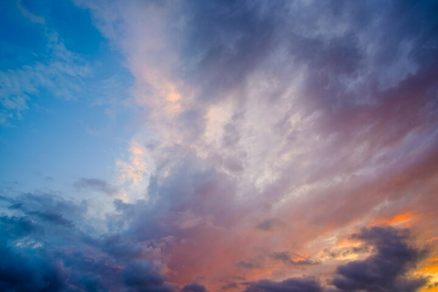
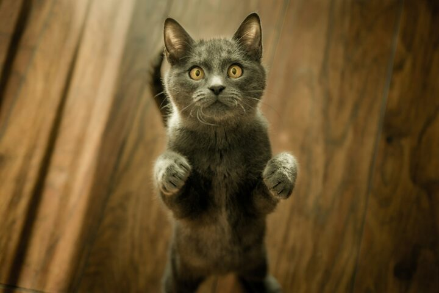
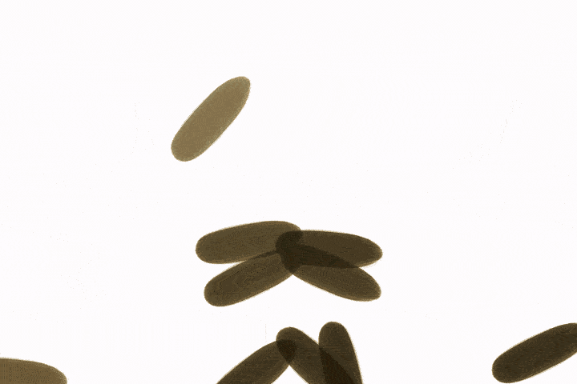

# Tile Paint - brush-stroke image recreation


## Overview

Tile Paint turns any image into a time‑lapse of a painting process built from brush masks.
The program reconstructs a target picture by placing many oriented brush strokes. Strokes start large and become smaller over time (coarse to fine). The result is a still image and, optionally, a short time‑lapse video of the reconstruction. No GPU and no ML are required; everything runs on CPU and is deterministic with a fixed seed.

Use cases: generative art, animated posters, teaching error‑driven rendering, or just fun experiments with custom brushes.

## Features

- Coarse to fine stroke phases (strict ordering from large to small).
- Orientation from local image structure (with optional jitter).
- Two ROI sampling strategies: `argmax` and `topk_random`.
- Deterministic runs via `--seed`.
- Optional time‑lapse video output.

## Gallery

Below are small, optimized demos.

<table>
<tr>
  <td align="center"><b>Original</b></td>
  <td align="center"><b>Final</b></td>
</tr>
<tr>
  <td></td>
  <td></td>
</tr>
</table>

A second example:

<table>
<tr>
  <td align="center"><b>Original</b></td>
  <td align="center"><b>Final</b></td>
</tr>
<tr>
  <td></td>
  <td></td>
</tr>
</table>

For more examples: see `docs/media/`.

## Install

Requirements:
- Python 3.10 to 3.13
- Windows, macOS, or Linux
- No GPU. No system ffmpeg required (video is handled via imageio-ffmpeg).

Clone and create a virtual env.

### Windows (PowerShell)
```powershell
git clone https://github.com/Romanafanasyev/tile-paint.git
cd tile-paint
python -m venv .venv
.\.venv\Scripts\Activate.ps1
pip install -r requirements.txt
cd src
python -m painter
```

### Windows (cmd.exe)
```cmd
git clone https://github.com/Romanafanasyev/tile-paint.git
cd tile-paint
python -m venv .venv
.\.venv\Scripts\activate.bat
pip install -r requirements.txt
cd src
python -m painter
```

### Linux/macOS (bash/zsh)
```bash
git clone https://github.com/Romanafanasyev/tile-paint.git
cd tile-paint
python -m venv .venv
source .venv/bin/activate
pip install -r requirements.txt
cd src
python -m painter
```

> For contributors: development tools live in `requirements-dev.txt` (ruff, mypy, pytest, pre-commit). Not required for running the program.

## Quick usage

Run with defaults:
```bash
cd src
python -m painter
```

Common options (see `python -m painter --help` for the full list):
```bash
# input/output
python -m painter \
  --input ../assets/input/your.jpg \
  --out-image ../outputs/images/final.png \
  --make-video true \
  --out-video ../outputs/video/out.mp4

# brushes (one or many grayscale PNGs; white = paint)
python -m painter --brush ../assets/brushes/brush.png --brush ../assets/brushes/brush2.png

# workload and size schedule
python -m painter \
  --workload 20 \
  --size-scale-mode log --levels 5 --largest-frac 0.35 --smallest-px 10

# quality and style
python -m painter \
  --roi-sampling topk_random \
  --start-color-hex "#FFFFFF" \
  --use-soft-edges true \
  --use-alpha false --alpha-value 0.25 \
  --seed 42
```

Full parameter reference is in `docs/PARAMS.md`.

## What to expect

- Works best on images with fewer tiny details and smoother color transitions.
- For sharper edges and more detail, increase `--workload` (more strokes) and, if needed, `--levels`.
- If strokes look too small, raise `--largest-frac` or reduce `--levels`.
- If it feels slow on CPU, set `--max-size` (for example 768) and lower `--workload`.

## Brushes

Brushes are grayscale PNG masks. White means paint is applied, black is transparent. Organic, irregular shapes produce the most natural look. Place files under `assets/brushes/` and pass one or many via `--brush`.

## Troubleshooting

- No video produced: run without `--make-video` or install ffmpeg if you prefer system binaries.
- Output looks too rough: increase `--workload` or `--levels`.
- Edges look too hard: enable `--use-soft-edges` or `--use-alpha`.
- Make sure brush masks are grayscale (not RGB with color tints). White should represent coverage.

## Development

- Format: `ruff format`
- Lint: `ruff check --fix`
- Types: `mypy src/painter`
- Tests: `pytest -q`
- Pre-commit: `pre-commit run -a`

## License

MIT. See `LICENSE`.
