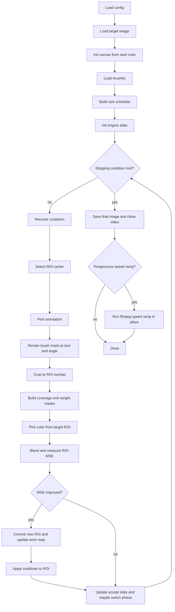

# Algorithm: stroke-based image reconstruction

This document explains how the painting loop works end-to-end. It is written so that an engineer can reimplement or extend the algorithm without reading the code.

## Overview

We reconstruct an input image by iteratively placing semi-transparent brush strokes on a canvas. The process runs in phases from large strokes to small strokes. Each attempted stroke is simulated and accepted only if it reduces mean squared error (MSE) against the target in the affected region. The engine keeps an error map, uses a ROI selector to pick where to paint next, orients the brush, blends a color that matches the target, and updates state. Optionally we record a video and apply a smooth speed ramp as a postprocess.

## Key terms

- ROI (region of interest): a local rectangular region on the canvas where we simulate and possibly apply a stroke. It is defined by the bounding box of the rotated brush mask intersected with the canvas frame.
- MSE: mean squared error between two RGB images. We use two forms: per-pixel MSE map and average MSE in a region.
- Coverage mask m: mask in [0,1] that indicates which pixels the stroke covers after rotation and scaling. White means paint, black means skip.
- Weight mask w: blend weights in [0,1] used during compositing. With soft edges enabled, w is a scaled version of m. With hard edges, w is binary after threshold.
- Cooldown map: a multiplicative priority map that temporarily downweights recently painted areas to improve spatial diversity. It does not change true error.
- Phase: a size level for strokes. We start with large sizes and move down when progress slows.

## End-to-end flow

## Per-step logic

### 1) ROI selection

We compute a weighted error map:
- If cooldown is disabled: weighted = err_map
- If cooldown is enabled: weighted = err_map * cooldown_weights

Two methods are supported:

- `argmax`: pick the single pixel with the highest weighted value.
- `topk_random`: take the indices of the top K weighted values, then sample one index uniformly at random. This gives diversity while still prioritizing high-error areas. Implementation detail: we find the top K with a partial selection (like `argpartition`) for O(N) average time, not a full sort.

The selected pixel becomes the center (y, x) for the stroke placement at the current size level.

### 2) Orientation

There are three modes: `gradient`, `random`, and `none`.

- `gradient`:
  - Convert target RGB to grayscale using BT.709 luma: `0.2126 R + 0.7152 G + 0.0722 B`.
  - Compute central-difference gradients on the grayscale image:
    - Ix = 0.5 * (roll left minus roll right) with clamped edges
    - Iy = 0.5 * (roll up minus roll down) with clamped edges
  - Sum gradients in a local window of size equal to the current stroke box. If the squared magnitude is below `grad_min_strength`, fall back to a random angle in [0, 180). Otherwise set the stroke angle to be perpendicular to the local gradient direction: `angle_deg = degrees(atan2(sum_y, sum_x)) + 90`.
  - Add Gaussian jitter with standard deviation `angle_jitter_deg`, then wrap to [0, 180).
- `random`: sample a uniform angle in [0, 180).
- `none`: use angle 0.

Angles are half-rotation equivalent because most brush shapes are symmetric under 180 degrees.

### 3) Brush rendering and ROI crop

- Take the brush mask in [0,1].
- Scale it so that `max(h, w)` equals the current stroke box size.
- Rotate by the chosen angle with bilinear resampling, `expand=True`, and black fill for new pixels.
- Compute the overlap between the rotated mask rectangle centered at the ROI center and the canvas frame. If there is no overlap, skip.

### 4) Coverage and weight masks

From the cropped mask ROI:

- If `use_soft_edges` is true: `m = clip(mask_roi, 0, 1)`.
- If `use_soft_edges` is false: `m = 1 where mask_roi >= mask_threshold else 0`.
- If `use_alpha` is true: `w = clip(alpha_value * m, 0, 1)`. Otherwise `w = m`.

We use `m` to compute color statistics from the target, and we use `w` to blend onto the canvas.

### 5) Color pick

Pick an RGB color as the weighted mean of the target ROI under coverage mask `m`:
- If sum(m) is very small, fall back to a plain mean over the ROI.
- Otherwise compute `color = sum(target * m3) / sum(m)`, where `m3` is `m` broadcast to 3 channels.

### 6) Blend and acceptance test

Let `roi_canvas` be the current canvas ROI and `roi_target` be the target ROI. Define per-image MSE as `mean((A - B)^2)` and per-pixel MSE map as the channel mean of squared differences.

- Compute old ROI MSE: `old = mean((roi_canvas - roi_target)^2)`.
- Simulate blended ROI: `new_roi = w3 * color + (1 - w3) * roi_canvas`, with `w3` as `w` broadcast to 3 channels.
- Compute new ROI MSE: `new = mean((new_roi - roi_target)^2)`.
- Accept if `new < old`. We also track simple gain figures for analysis: total gain is `(old - new) * area` and per-covered-pixel gain is `total_gain / sum(w)`.

### 7) Commit and cooldown

If accepted:
- Write `new_roi` back to the canvas.
- Update `err_map` only inside the ROI using per-pixel MSE.
- Apply cooldown to the ROI: `weights *= 1 - (1 - cooldown_factor) * mask_binary` where `mask_binary = 1 where mask_roi > 0`. Then clip to `[cooldown_min, cooldown_max]`.

Each step also calls `recover()` before selection: `weights *= cooldown_recover` then clip to `[cooldown_min, cooldown_max]`. This slowly restores priorities of recently painted areas.

## Phase schedule

We precompute a strictly decreasing list of stroke box sizes from `s_max` to `s_min` with either log or linear spacing:
- `s_max = max(smallest_px, round(min(H, W) * largest_frac))`
- `s_min = max(1, smallest_px)`
- `levels >= 2`

We start at the largest size. After each attempt we update a rolling accept window. We move down to the next smaller size when either:
- accept rate in the recent window drops below `phase_accept_threshold` and we have made at least `phase_min_strokes` attempts in this phase, or
- we reach a phase-specific max attempts limit estimated as `phase_max_attempts_factor * (H * W) / size^2` (clamped by `phase_min_strokes`).

On phase change we reset attempts, clear the accept window, recompute the phase max attempts for the new size, and reset the cooldown map to neutral.

## Stopping conditions

- Hard cap: `total_strokes` attempts.
- Optional quality cap: if `target_mse` is set and the global average of `err_map` is below or equal to it, stop early.

## Determinism and randomness

With a fixed `seed`, the numpy generator drives:
- brush index selection,
- ROI selection when using `topk_random`,
- random orientation when structure is weak or when `orientation_mode` is `random`,
- angle jitter.

Other operations are deterministic given the same inputs and configuration.

## Video output and speed ramp

When video recording is enabled, the pipeline writes frames at a controlled cadence:
- If `save_every_n_strokes` is set and positive, one frame is written every N accepted strokes.
- Otherwise it estimates the number of frames based on `video_fps` and `video_duration_sec` and chooses a stride that fits the total stroke budget.

At the end we optionally apply a smooth speed ramp in place using ffmpeg. The clip is split into three parts:
- Slow start: speed rises from `slow_from` to 1.0 over `slow_seconds`, divided into `steps` subsegments with smoothstep easing.
- Middle: unchanged speed.
- Fast end: speed rises from 1.0 to `fast_to` over `fast_seconds`, divided into `steps` subsegments with smoothstep easing.

If the input has audio, an atempo chain is generated that stays within ffmpeg atempo limits by splitting the factor into 0.5 to 2.0 chunks and a residual multiplier.

## Performance notes

- ROI selection with `topk_random` uses partial selection of the top K in O(N) average time, then a constant-time random pick among them.
- All heavy operations are local to an ROI: mask render, blend, and MSE check operate only on cropped windows.
- The engine updates the per-pixel error map only inside the ROI, which keeps work proportional to stroke area.
- Cooldown is array-wise multiply and clip, which is cheap.

## Glossary

- ROI: rectangular region around the stroke placement where we simulate and possibly apply the stroke.
- MSE: mean squared error, average of squared per-channel differences.
- Coverage mask m: mask that says what the brush covers.
- Weight mask w: mask used as the alpha during blending.
- Accept rate: ratio of accepted strokes in a rolling window.
