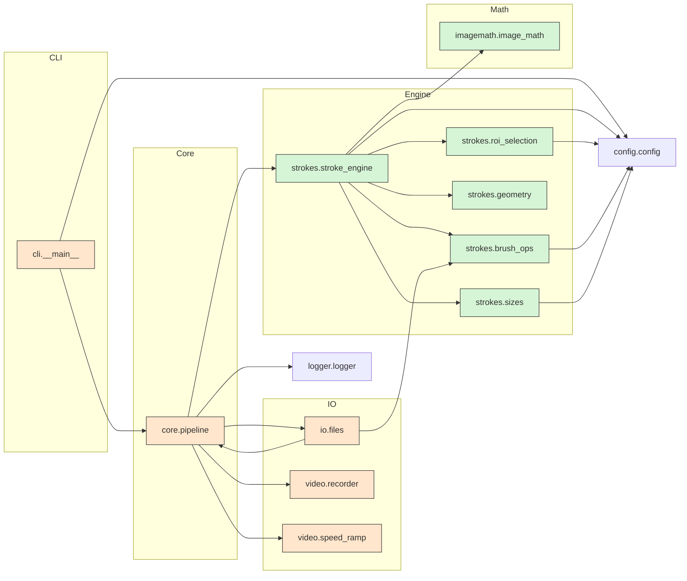

# Architecture

This page shows module boundaries, what is pure and what has side effects, and how data flows at runtime.

## Overview

- `cli` parses flags and builds `Config`.
- `core.pipeline` orchestrates the run: loads inputs, runs the engine, writes outputs, and optionally postprocesses video.
- `strokes.*` is the core engine and helpers. It is pure in the sense that it only manipulates in-memory arrays.
- `imagemath` provides small numeric helpers and is pure.
- `io.files` and `video.*` perform side effects: disk I O and ffmpeg subprocess.
- `config` defines validated parameters used everywhere.
- `logger` configures runtime logs.

## Module diagram

Legend: green nodes are pure. Orange nodes perform side effects.

## Runtime data flow

1. CLI builds `Config` and calls the pipeline.
2. Pipeline loads the target image and brush masks from disk, converts them to float arrays.
3. Pipeline creates the cooldown map and the engine with the target, canvas, brushes, and RNG.
4. Pipeline runs the main loop:
   - recover cooldown
   - select ROI center using error map and cooldown
   - pick orientation
   - render and crop brush mask
   - build coverage and weight masks
   - pick color from target
   - blend and test MSE
   - on accept, commit and update error map, apply cooldown
   - maybe switch phase based on accept rate and attempt budget
5. Pipeline saves the final image and closes the video.
6. Optional: speed ramp postprocess replaces the video file in place.

## Dependency rules

- Engine modules depend on imagemath and config only. They do not touch disk or subprocess.
- IO and video modules do all side effects.
- Pipeline can call any module.
- Keep imagemath leaf pure.

This split keeps the core easy to unit test and the side effects easy to mock.
